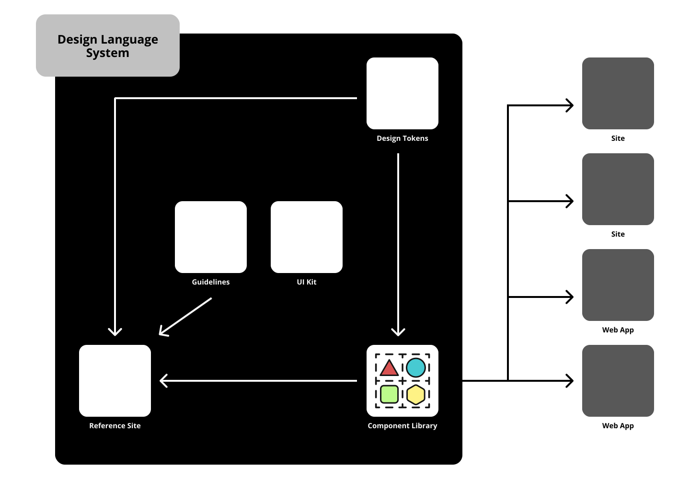

<div align="center">

  <a href="https://github.com/chepetime/react-turborepo-dls">
    
  </a>
  <h2 align="center"><strong>Design Language System</strong></h2>
  <h3 align="center"><strong>Turborepo, React, Storybook</strong></h3>
  <p align="center">
    Design Language System built with React, Storybook and Turborepo
  </p>

[](https://github.com/chepetime/react-turborepo-dls/actions/workflows/ci.yml)

</div>
<br/>

<br/>

## 📓 About

This repository contains a coded example of a Design Language System with Turborepo, React, Storybook and NextJs.

<div align="center">
  
</div>
<br/>

## 🏗 Structure

This monorepository contains multiple projects that work together to create an integrated Design Language System.

### Packages

> Packages are reusable libraries available for packages and apps

| Package directory               | Description                                                          |
| ------------------------------- | -------------------------------------------------------------------- |
| `packages/eslint-config-custom` | Shared Eslint configuration for all packages                         |
| `packages/tsconfig`             | Shared Typescript configuration for all packages                     |
| `packages/ui`                   | React based component library                                        |
| `packages/generator`            | Terminal tool that creates Components for the React UI Library (WIP) |
| `packages/token-manager`        | Terminal tool that manages design tokens (WIP)                       |

### Apps

> Apps can use all the available packages

| App directory | Description                                            |
| ------------- | ------------------------------------------------------ |
| `apps/web`    | NextJs web app that implements the React UI Library    |
| `apps/docs`   | Storybok instance that implements the React UI Library |

<br/>

## 📦 Getting Started

These instructions will get you a copy of the project up and running on your local machine for development and testing purposes. See deployment for notes on how to deploy the project on a live system.

Make sure you have the (Node)[https://nodejs.dev/] LTS version (18.7) installed in your machine. We recommend to use [nvm (Node Version Manager)](https://github.com/nvm-sh/nvm).

This monorepository uses Turborepo to manage dependencies and scripts. The first step is to install the local node dependencies:

```sh
npm Install
```

## 🖍 Development

This Turborepo has two main ways to work with components:

- Watch the React UI Library + Storybook App
- Watch the React UI Library + NextJS App

### Development Storybook

To watch changes in the React Library and start the Storybook App, just run:

```sh
npm run storybook
```

### Development Next.js App

To watch changes in the React Library and start the Next.Js App, just run:

```sh
npm run dev
```

### Token Manager (WIP)

This project contains a Token Manager, which can be conigured using a configuration file named `.tokens.config.json` at the root of the React UI Library.

Then you can run the token engine task which will:

- Build the Token Manager project
- Download the latest tokens
- Transforms them into desirable formats
- Outputs them into the desired output
- Builds the React UI project (to check for build errors)

Run the following command to start the token management process:

```sh
npm run token
```

> The Code for the Token Manager can be looked at `packages/token-manager`.

<br/>

## 🚀 Deployment

<br/>

<!-- ## 🥽 Tests

Explain how to run the automated tests for this system

<br/>

### Break down into end to end tests

Explain what these tests test and why

```
Give an example
```

<br/>
-->

## 🧪 Built With

- [React@18](https://reactjs.org/)
- [NextJs](https://nextjs.org/)
- [Storybook](https://storybook.js.org/)
- [Turborepo](https://turborepo.org/)

<br/>

<!-- ## 👥 Contributing

Please read [CONTRIBUTING.md]() for details on our code of conduct, and the process for submitting pull requests to us.

<br/>

## 🏷 Versioning

We use [SemVer](http://semver.org/) for versioning. For the versions available, see the [tags on this repository](https://github.com/your/project/tags).

<br/> -->

## 🤺 Authors

- **José M. Gulias Lugo** - _Main Dev_ - [ChepeTime](https://github.com/ChepeTime)

<br/>

<!-- ## 🎩 Acknowledgments

> Template -->

<br/>

---

Made by [@chepetime](https://github.com/chepetime) in Mexico City 🇲🇽
