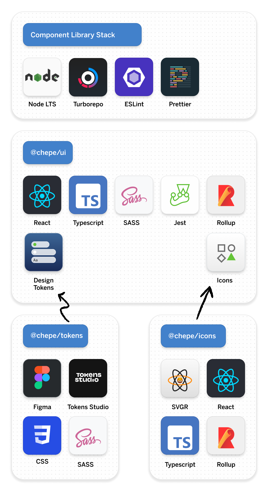

<div align="center">
  <a href="https://github.com/chepetime/react-turborepo-dls-ops">
    
  </a>
  <h2 align="center"><strong>Design Language System</strong></h2>
  <p align="center">
    Implementation of chepe's Design Language System using React and Turborepo
  </p>

[](https://github.com/chepetime/react-turborepo-dls-ops/actions/workflows/ci.yml) [](https://github.com/chepetime/react-turborepo-dls-ops/actions/workflows/storybook-tests.yml)
[](https://main--63cb088b050236561c70fbc6.chromatic.com)
[](https://chromatic.com/library?appId=63cb088b050236561c70fbc6&branch=main)

</div>
<br/>

<br/>

## Getting Started

Welcome to chepe DLS, chepe's Design Language System for products, digital experiences and brand.

- [Figma File Demo](https://www.figma.com/file/VgZTsIrH0uIGxTgAHFmlja/chepe-Design-Tokens-Demo?node-id=0%3A1&t=i5KbPMlzHdXPVssq-1)
- [Chromatic Invite](https://www.chromatic.com/start?inviteToken=407c0fa9348d44f5990ca673bda82e20&appId=63cb088b050236561c70fbc6)

<br/>

## Structure

This monorepository contains multiple projects that work together to create an integrated Design Language System.

<div align="center">
  
</div>

### Packages

> Packages are reusable libraries available for packages and apps

| Package directory       | Description                                                    |
| ----------------------- | -------------------------------------------------------------- |
| `packages/chepe-ui`     | React based component library with Typescript, Rollup and SASS |
| `packages/chepe-tokens` | Design Tokens distributable package                            |
| `packages/chepe-icons`  | React based icon library with SVGR and Rollup                  |

### Apps

> Apps can use all the available packages

| App directory | Description                                            |
| ------------- | ------------------------------------------------------ |
| `apps/docs`   | Storybok instance that implements the React UI Library |
| `apps/web`    | React web app that implements the React UI Library     |

### Config

> Config are reusable eslint and typescript configurations

| Package directory               | Description                                      |
| ------------------------------- | ------------------------------------------------ |
| `packages/eslint-config-custom` | Shared Eslint configuration for all packages     |
| `packages/ts-config-custom`     | Shared Typescript configuration for all packages |

### Tools

> Tools to generate Components or get Tokens

| App directory     | Description                                               |
| ----------------- | --------------------------------------------------------- |
| `tools/generator` | CLI Tool that creates Components for the React UI Library |

<br/>

## Development

These instructions will get you a copy of the project up and running on your local machine for development and testing purposes. See deployment for notes on how to deploy the project on a live system.

Make sure you have the LTS version of [Node](https://nodejs.dev/) (18.7) installed in your machine. We recommend to use [nvm (Node Version Manager)](https://github.com/nvm-sh/nvm).

This monorepository uses Turborepo to manage dependencies and scripts. The first step is to install the local node dependencies:

```sh
npm install
```

There are two main ways to develop new components:

- Storybook App (Vite)
- Watch the React UI Library (Rollup) + Create React App

### Development Storybook

To watch changes in the React Library and start the Storybook App, just run:

```sh
npm run storybook
```

> This instance of Storybook uses the source code to compile the React Stories. It's faster than watching changes and reloading and it gets HMR. That's the reason components are imported using `@chepe/ui/src` instead of `@chepe/ui`.

### Development Create React App

To watch changes in the React Library and start the Next.Js App, just run:

```sh
npm run web
```

> Contrary to the Storybook instance, this React App uses the bundled code inside React. It should be really similar to the final package being used by product teams.

<br/>

## Continuous Integration

This project has multiple GitHub Actions for build, test and deployment.

You can finds all the GitHub actions files inside `.github/workflows/`

| Name            | File                  | Description                                                             |
| --------------- | --------------------- | ----------------------------------------------------------------------- |
| Build           | `ci.yml`              | Builds the main Component Library. (@chepe/ui)                          |
| Storybook Tests | `storybook-tests.yml` | Turns all the Storybook _stories_ into executable tests including a11y. |

<br/>

## Tools

### Add a new Component

You can add a new Component Boilerplate using the Generator Tool.

```sh
npm run generate:component --name=Heading
npm run generate:component --name=InputField
```

<br/>

<!--

## 🚀 Deployment

<br/>

 ## 🥽 Tests

Explain how to run the automated tests for this system

<br/>

### Break down into end to end tests

Explain what these tests test and why

```
Give an example
```

<br/>


## 🧰 Developing (WIP)

### Integration - React (WIP)

### Browser Support (WIP)

### Event Handling (WIP)

### Testing (WIP)

-->

## Built With

- [React@18](https://reactjs.org/)
- [Rollup](https://rollupjs.org/)
- [Storybook](https://storybook.js.org/)
- [Turborepo](https://turborepo.org/)

<br/>

<!-- ## 👥 Contributing

Please read [CONTRIBUTING.md]() for details on our code of conduct, and the process for submitting pull requests to us.

<br/>

## 🏷 Versioning

We use [SemVer](http://semver.org/) for versioning. For the versions available, see the [tags on this repository](https://github.com/your/project/tags).

<br/> -->

## 🤺 Authors

- [jose.lugo](mailto:me@joselugo.dev) - [GitHub](https://github.com/chepetimetime)

<br/>

<!-- ## 🎩 Acknowledgments

> Template

<br/>

 -->

---

Made by [@chepetime](https://github.com/chepetimetime) at Mexico City 🇲🇽
