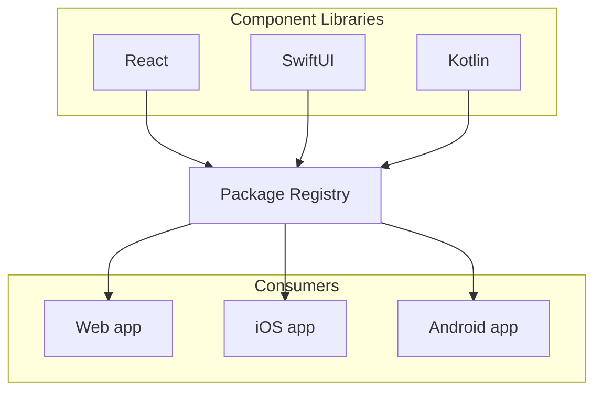

import { Callout } from "nextra/components";
import Image from "next/image";
import { Button } from "@chepe/ui";
import { Jellyfish } from "@chepe/icons";
import ComponentContainer from "./../../components/ComponentContainer/ComponentContainer";

<Callout emoji="⚠️" type="warning">
  WIP - Dummy content
</Callout>

# Development Resources

<Callout emoji="💡" type="info">
  **Purpose:** The Development Resources section provides essential information
  and documentation for developers working with the design system, including
  details about supported platforms and development guidelines.
</Callout>

> **Recommendations:**
>
> - Provide an overview of the development resources available in your design system.
> - Include information about the development process and how the design system fits into it.
> - Mention any coding standards, conventions, or guidelines specific to your design system.
> - Consider including links or references to additional resources that developers might find helpful, such as coding style guides or documentation on design patterns.

## Architecture



## Platforms (React, React Native, Swift, Kotlin)

<Callout emoji="💡" type="info">
  **Purpose:** The Platforms section highlights the supported platforms for
  development within the design system, such as React, React Native, Swift,
  Kotlin, or any other platforms your team uses.
</Callout>

### React

<Callout emoji="💡" type="info">
  **Purpose:** The Install and App Setup section provides instructions and
  guidelines for installing the necessary dependencies and setting up the
  development environment to work with the design system.
</Callout>

To use an example instance of this project, you can install `@chepe/ui` and `@chepe/icons`.

Start a new React App.

```sh
npx create-react-app my-app
cd my-app
```

Install the `@chepe` ui and icons.

```sh copy
npm install @chepe/ui @chepe/icons
```

Now you can use the components of `@chepe/ui` in your react application:

```tsx filename="src/App.js" {1,2,7,8,9,10} copy
import { Button } from "@chepe/ui";
import { Jellyfish } from "@chepe/icons";

function App() {
  return (
    <div className="App">
      <Button>
        Hello World
        <Jellyfish size={32} fill="#fff" />
      </Button>
    </div>
  );
}

export default App;
```

<ComponentContainer>
  <Button>
    Hi
    <Jellyfish size={32} fill="#fff" />
  </Button>
</ComponentContainer>

### React Native

### Swift

### Kotlin

### Other Platforms

## Design System Development

These instructions will get you a copy of the project up and running on your local machine for development and testing purposes.

Make sure you have the LTS version of [Node](https://nodejs.dev/) (18.15) installed in your machine. We recommend to use [nvm (Node Version Manager)](https://github.com/nvm-sh/nvm).

```sh
node -v # 18.15
```

**pnpm**: Install the current version of the [pnpm](https://pnpm.io/).

```sh
pnpm -v # 8.4.0
```

Clone the project in your machine.

```sh
git clone https://github.com/chepetime/react-design-system.git
cd react-design-system
```

This monorepository uses [Turborepo](https://turbo.build/) to manage dependencies and scripts. The first step is to install the local node dependencies.

```sh
git clone https://github.com/chepetime/react-design-system.git
cd react-design-system
pnpm i
```

There are two main ways to develop new components:

- Storybook App (Vite)
- Watch the React UI Library (Rollup) + NextJs

### Development Tasks

Start the **UI Development** environment with Storybook.

```sh
npm run dev
```

> This instance of Storybook uses the source code to compile the React Stories. It's faster than watching changes and then reloading, it also gets HMR. That's the reason components are imported using `@chepe/ui/src` instead of `@chepe/ui`.

Start the **Web Development** environment with NextJs.

```sh
npm run web
```

> Contrary to the Storybook instance, this Next App uses the bundled code of the UU. It should be really similar to the final package being used by product teams.

Start the **Documentation Development** environment with [Nextra](https://nextra.site/).

```sh
npm run docs
```

### Utils

#### Component Generator

You can add a new Component Boilerplate using the Generator Tool inside the `tools/generator` directory. You can run this commands at the root of the project:

```sh
npm run generate:component --name=Heading
npm run generate:component --name=InputField
```

#### Dependency maintenance

You can update dependencies using the maintenance command:

```sh
npm run maintenance

```
